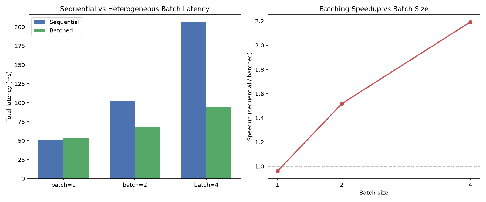
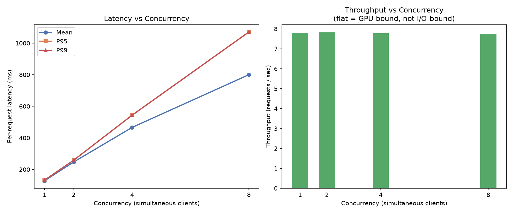

# lora-switchboard

A high-performance, multi-tenant LLM inference engine that serves hundreds of LoRA adapters on a single GPU node — without reloading the base model between requests.

## The Problem

The naive approach to serving N fine-tuned model variants loads N copies of the model into GPU memory. At 7B parameters per copy, that's untenable at any scale.

**LoRA fine-tuning doesn't change the whole model.** It adds two small matrices — A and B — on top of specific linear layers. The base weights stay identical across every fine-tuned variant.

lora-switchboard exploits this: load the base model once, freeze it, and swap only the adapter matrices per request.

```
output = x · W₀  +  x · A · B
          ↑               ↑
      base model      LoRA delta
    frozen in VRAM    ~0.1% the size
```

100 adapters becomes 1 model + 100 pairs of tiny matrices.

---

## Architecture

```
┌─────────────────────────────────────────────────────────┐
│                    FastAPI (async)                       │
│  POST /infer   POST /adapters/load-from-hub   GET /...  │
└────────────────────────┬────────────────────────────────┘
                         │ asyncio.Queue
                         ▼
┌─────────────────────────────────────────────────────────┐
│              RequestScheduler (single GPU thread)        │
│  Decouples async I/O from blocking PyTorch compute       │
│  Resolves per-request asyncio.Future when done           │
└────────────────────────┬────────────────────────────────┘
                         │ activate(adapter_id)
                         ▼
┌─────────────────────────────────────────────────────────┐
│                   WeightManager                          │
│                                                          │
│  CPU Registry ──── all known adapters (host RAM)         │
│       │                                                  │
│       │ H2D transfer on cache miss                       │
│       ▼                                                  │
│  GPU Cache ──── LRU, bounded by max_cached (VRAM)        │
│       │                                                  │
│       │ inject A, B tensors                              │
│       ▼                                                  │
│  LoRALinear layers in frozen base model                  │
└─────────────────────────────────────────────────────────┘
```

### Components

| File | Role |
|------|------|
| `engine/core/lora_layer.py` | Wraps `nn.Linear` with swappable A/B slots; single-adapter and scatter-gather batch paths |
| `engine/core/batch_context.py` | Thread-local position map that signals `LoRALinear` to use the batch path |
| `engine/core/hetero_batcher.py` | Orchestrates heterogeneous batch: pad inputs, load adapters, run one `generate()` call |
| `engine/core/model_loader.py` | Loads base model frozen, replaces target layers with `LoRALinear` in-place |
| `engine/core/weight_manager.py` | Two-tier memory: CPU registry (permanent) + GPU LRU cache (bounded) |
| `engine/core/adapter_loader.py` | Parses PEFT-format adapters from disk or HuggingFace Hub |
| `engine/scheduler/request_queue.py` | `asyncio.Queue` + `ThreadPoolExecutor(1)` isolates GPU thread from event loop |
| `engine/api/routes.py` | REST endpoints for inference, batch inference, and adapter lifecycle |
| `engine/main.py` | FastAPI app wiring with lifespan startup/shutdown |

---

## Quickstart

```bash
git clone https://github.com/bhavyam2/lora-switchboard.git
cd lora-switchboard

python3 -m venv .venv && source .venv/bin/activate
pip install -r requirements.txt

uvicorn engine.main:app --reload
```

The server downloads `EleutherAI/pythia-70m` on first launch (~150MB) and patches 6 linear layers with LoRA wrappers.

### Load an adapter and run inference

**From HuggingFace Hub:**
```bash
curl -X POST http://localhost:8000/api/v1/adapters/load-from-hub \
  -H "Content-Type: application/json" \
  -d '{"adapter_id": "my-adapter", "hub_repo_id": "username/repo-name"}'
```

**From a local PEFT directory:**
```bash
curl -X POST http://localhost:8000/api/v1/adapters/load-from-dir \
  -H "Content-Type: application/json" \
  -d '{"adapter_id": "my-adapter", "path": "data/adapters/my-adapter"}'
```

**Run inference:**
```bash
curl -X POST http://localhost:8000/api/v1/infer \
  -H "Content-Type: application/json" \
  -d '{"prompt": "Analyze system metrics:", "adapter_id": "my-adapter"}'
```

**Run a heterogeneous batch (multiple adapters, one forward pass):**
```bash
curl -X POST http://localhost:8000/api/v1/batch-infer \
  -H "Content-Type: application/json" \
  -d '{
    "requests": [
      {"prompt": "Analyze system metrics:", "adapter_id": "analytics-v1"},
      {"prompt": "Summarize the following:", "adapter_id": "summarizer-v1"},
      {"prompt": "Translate this text:",     "adapter_id": "translate-v1"}
    ],
    "max_new_tokens": 50
  }'
```

**Check GPU cache state:**
```bash
curl http://localhost:8000/api/v1/adapters/cached
```

### Generate a test adapter (no training required)

```bash
python scripts/create_test_adapter.py
# → data/adapters/test-peft-adapter/
```

---

## Benchmarks

### Adapter switching overhead

```bash
python scripts/benchmark.py --requests 30 --tokens 20
```

Results on Apple M-series CPU (`EleutherAI/pythia-70m`, 20 tokens):

```
===================================================================================
Scenario                       Adapters  Cache   Mean ms   P50 ms   P95 ms   P99 ms
===================================================================================
1. Base (no adapter)                  0      8      47.8     47.7     50.3     50.3
2. Single adapter (cache hit)         1      8      51.1     50.1     70.0     70.0
3. Multi-adapter (no eviction)        4      8      49.6     49.5     52.2     52.2
4. Cache pressure (evictions)        12      4      49.7     49.6     51.3     51.3
===================================================================================
```

**Reading the numbers:**
- **Scenario 1 → 2:** LoRA delta computation adds ~3ms — negligible.
- **Scenario 2 → 3:** Cycling 4 adapters within cache capacity is free — swapping is just a pointer reassignment into the `LoRALinear` layer slots.
- **Scenario 3 → 4:** On CPU, cache evictions look cheap because H2D is just a `memcpy`. On a real GPU, PCIe bandwidth makes this the expensive path — exactly why the LRU cache exists.


---

### Heterogeneous batching speedup

```bash
python scripts/benchmark_batching.py --batch-sizes 1,2,4 --runs 5 --tokens 20
```

Compares N sequential single-adapter calls against one `batch-infer` call carrying N requests with different adapters, processed in a single `model.generate()` forward pass via scatter-gather routing.

Results on Apple M-series CPU (`EleutherAI/pythia-70m`, 20 tokens):

```
=================================================================
 Batch  Seq mean ms  Batch mean ms   Speedup   Seq P95  Batch P95
=================================================================
     1         51.3           53.4     0.96x      52.4       54.2
     2        102.4           67.5     1.52x     102.9       69.6
     4        206.0           94.0     2.19x     222.2       96.3
=================================================================
```

**Reading the numbers:**
- **Batch 1:** No benefit — one request is one request regardless of path.
- **Batch 2→4:** Sequential time scales linearly with N; batched time grows sub-linearly because the base model's matrix multiplications parallelise across the batch dimension.
- **On GPU:** The gap widens significantly. PCIe bandwidth makes sequential adapter swaps expensive; batching amortises the H2D cost across all requests in the group.



---

## Key Design Decisions

**GIL isolation via single-thread executor**
FastAPI's async event loop cannot block on PyTorch compute. A `ThreadPoolExecutor(max_workers=1)` owns the GPU exclusively; the async side enqueues requests and awaits `asyncio.Future` resolution. This gives you concurrent HTTP handling without parallelising GPU work.

**Two-tier memory model**
Adapters live in a CPU registry (never evicted) and a GPU LRU cache (bounded by `adapter_cache_max`). On a cache miss, the engine does an H2D transfer and evicts the LRU GPU resident. This mirrors how OS page tables separate virtual from physical address space.

**In-place layer surgery**
Rather than wrapping the model externally, `model_loader.py` walks `model.named_modules()` and replaces target `nn.Linear` instances with `LoRALinear` wrappers in-place. The model graph is unaware of the change — the same `generate()` call activates the LoRA path transparently.

**Dtype-aware H2D transfer**
PEFT serialises adapter weights as `float32`. Base models often load as `float16`. The weight manager casts on the way to the GPU (`A.to(device, dtype=layer.base.weight.dtype)`), making loading from Hub, disk, or random initialisation all dtype-safe.

**Heterogeneous scatter-gather**
`LoRALinear.forward()` has two paths. In single-adapter mode it applies one delta to the full input. In batch mode, `BatchContext` supplies a position map (`adapter_id → [batch indices]`); the layer gathers each adapter's rows, computes the delta, and scatters back — all adapters resolved in one forward pass with no repeated base-model compute.

---

## API Reference

| Method | Endpoint | Body |
|--------|----------|------|
| `GET` | `/health` | — |
| `POST` | `/api/v1/infer` | `{prompt, adapter_id}` |
| `GET` | `/api/v1/adapters/cached` | — |
| `POST` | `/api/v1/adapters/load-from-hub` | `{adapter_id, hub_repo_id}` |
| `POST` | `/api/v1/adapters/load-from-dir` | `{adapter_id, path}` |
| `POST` | `/api/v1/adapters/register-random` | `?adapter_id=<id>` |
| `POST` | `/api/v1/batch-infer` | `{requests: [{prompt, adapter_id}], max_new_tokens}` |

---

## Tests

```bash
pytest tests/ -v
```

- `test_lora_layer.py` — verifies LoRA math (`h = xW₀ + xBA`), passthrough without adapter, clean unload
- `test_weight_manager.py` — verifies LRU eviction policy, adapter activation, cache state cleanup
- `test_hetero_batcher.py` — verifies scatter-gather routing, per-adapter delta correctness, mode isolation

---

### Concurrent load

```bash
# Server must be running first: uvicorn engine.main:app --port 8000
python scripts/benchmark_concurrent.py --concurrency 1,2,4,8 --requests 16 --adapters 4 --tokens 20
```

Fires N simultaneous HTTP clients at the live server. Measures throughput (req/s) and per-request latency at each concurrency level.

Results on Apple M-series CPU (`EleutherAI/pythia-70m`, 4 adapters, 20 tokens):

```
====================================================================
 Conc  Adapters   Req/s   Mean ms   P50 ms   P95 ms   P99 ms  Errors
====================================================================
    1         4    7.81     128.1    127.7    132.2    132.2       0
    2         4    7.82     247.4    255.0    258.7    258.7       0
    4         4    7.79     466.3    500.7    543.6    543.6       0
    8         4    7.72     800.2   1004.5   1070.6   1070.6       0
====================================================================
```

**Reading the numbers:**
- **Throughput is flat at ~7.8 req/s** across all concurrency levels — the system is GPU-bound. Adding concurrent clients does not add capacity, but it also does not degrade throughput or drop requests.
- **Latency scales linearly with concurrency** — at concurrency 8, mean latency is ~8× the single-client baseline. This confirms the `asyncio.Queue` is serialising requests correctly onto the single GPU thread: each request waits its turn, gets processed fully, and returns.
- **Zero errors at every concurrency level** — the async scheduler absorbs concurrent load without crashes, timeouts, or race conditions.



---

## Roadmap

- [x] Heterogeneous batching — scatter-gather routing across adapters in one forward pass
- [x] Concurrent load benchmarks — ~7.8 req/s throughput, flat across concurrency levels, zero errors
- [ ] Frontend — live cache visualisation and prompt playground
- [ ] Docker + GPU deployment — RunPod / Lambda Labs with real PCIe bandwidth numbers
