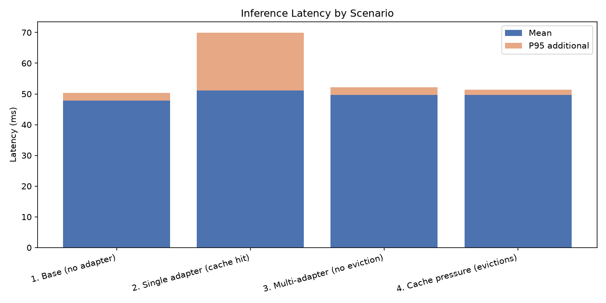
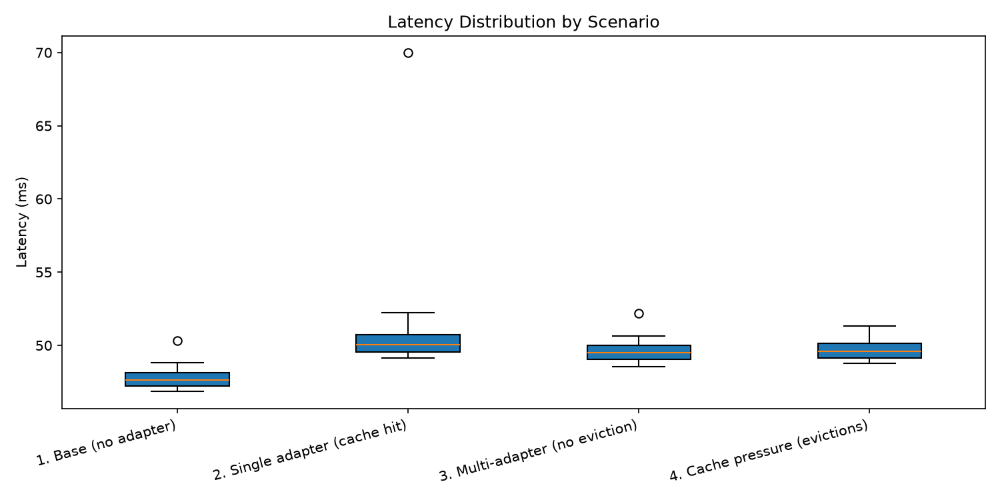

# lora-switchboard

A high-performance, multi-tenant LLM inference engine that serves hundreds of LoRA adapters on a single GPU node — without reloading the base model between requests.

## The Problem

The naive approach to serving N fine-tuned model variants loads N copies of the model into GPU memory. At 7B parameters per copy, that's untenable at any scale.

**LoRA fine-tuning doesn't change the whole model.** It adds two small matrices — A and B — on top of specific linear layers. The base weights stay identical across every fine-tuned variant.

lora-switchboard exploits this: load the base model once, freeze it, and swap only the adapter matrices per request.

```
output = x · W₀  +  x · A · B
          ↑               ↑
      base model      LoRA delta
    frozen in VRAM    ~0.1% the size
```

100 adapters becomes 1 model + 100 pairs of tiny matrices.

---

## Architecture

```
┌─────────────────────────────────────────────────────────┐
│                    FastAPI (async)                       │
│  POST /infer   POST /adapters/load-from-hub   GET /...  │
└────────────────────────┬────────────────────────────────┘
                         │ asyncio.Queue
                         ▼
┌─────────────────────────────────────────────────────────┐
│              RequestScheduler (single GPU thread)        │
│  Decouples async I/O from blocking PyTorch compute       │
│  Resolves per-request asyncio.Future when done           │
└────────────────────────┬────────────────────────────────┘
                         │ activate(adapter_id)
                         ▼
┌─────────────────────────────────────────────────────────┐
│                   WeightManager                          │
│                                                          │
│  CPU Registry ──── all known adapters (host RAM)         │
│       │                                                  │
│       │ H2D transfer on cache miss                       │
│       ▼                                                  │
│  GPU Cache ──── LRU, bounded by max_cached (VRAM)        │
│       │                                                  │
│       │ inject A, B tensors                              │
│       ▼                                                  │
│  LoRALinear layers in frozen base model                  │
└─────────────────────────────────────────────────────────┘
```

### Components

| File | Role |
|------|------|
| `engine/core/lora_layer.py` | Wraps `nn.Linear` with swappable A/B slots; computes `h = xW₀ + xBA` |
| `engine/core/model_loader.py` | Loads base model frozen, replaces target layers with `LoRALinear` in-place |
| `engine/core/weight_manager.py` | Two-tier memory: CPU registry (permanent) + GPU LRU cache (bounded) |
| `engine/core/adapter_loader.py` | Parses PEFT-format adapters from disk or HuggingFace Hub |
| `engine/scheduler/request_queue.py` | `asyncio.Queue` + `ThreadPoolExecutor(1)` isolates GPU thread from event loop |
| `engine/api/routes.py` | REST endpoints for inference and adapter lifecycle |
| `engine/main.py` | FastAPI app wiring with lifespan startup/shutdown |

---

## Quickstart

```bash
git clone https://github.com/bhavyam2/lora-switchboard.git
cd lora-switchboard

python3 -m venv .venv && source .venv/bin/activate
pip install -r requirements.txt

uvicorn engine.main:app --reload
```

The server downloads `EleutherAI/pythia-70m` on first launch (~150MB) and patches 6 linear layers with LoRA wrappers.

### Load an adapter and run inference

**From HuggingFace Hub:**
```bash
curl -X POST http://localhost:8000/api/v1/adapters/load-from-hub \
  -H "Content-Type: application/json" \
  -d '{"adapter_id": "my-adapter", "hub_repo_id": "username/repo-name"}'
```

**From a local PEFT directory:**
```bash
curl -X POST http://localhost:8000/api/v1/adapters/load-from-dir \
  -H "Content-Type: application/json" \
  -d '{"adapter_id": "my-adapter", "path": "data/adapters/my-adapter"}'
```

**Run inference:**
```bash
curl -X POST http://localhost:8000/api/v1/infer \
  -H "Content-Type: application/json" \
  -d '{"prompt": "Analyze system metrics:", "adapter_id": "my-adapter"}'
```

**Check GPU cache state:**
```bash
curl http://localhost:8000/api/v1/adapters/cached
```

### Generate a test adapter (no training required)

```bash
python scripts/create_test_adapter.py
# → data/adapters/test-peft-adapter/
```

---

## Benchmarks

Run against the live engine (no HTTP overhead):

```bash
python scripts/benchmark.py --requests 30 --tokens 20
```

Results on Apple M-series CPU (`EleutherAI/pythia-70m`, 20 tokens):

```
===================================================================================
Scenario                       Adapters  Cache   Mean ms   P50 ms   P95 ms   P99 ms
===================================================================================
1. Base (no adapter)                  0      8      47.8     47.7     50.3     50.3
2. Single adapter (cache hit)         1      8      51.1     50.1     70.0     70.0
3. Multi-adapter (no eviction)        4      8      49.6     49.5     52.2     52.2
4. Cache pressure (evictions)        12      4      49.7     49.6     51.3     51.3
===================================================================================
```

**Reading the numbers:**
- **Scenario 1 → 2:** LoRA delta computation adds ~3ms — negligible.
- **Scenario 2 → 3:** Cycling 4 adapters within cache capacity is free — swapping is just a pointer reassignment into the `LoRALinear` layer slots.
- **Scenario 3 → 4:** On CPU, cache evictions look cheap because H2D is just a `memcpy`. On a real GPU, PCIe bandwidth makes this the expensive path — exactly why the LRU cache exists.




---

## Key Design Decisions

**GIL isolation via single-thread executor**
FastAPI's async event loop cannot block on PyTorch compute. A `ThreadPoolExecutor(max_workers=1)` owns the GPU exclusively; the async side enqueues requests and awaits `asyncio.Future` resolution. This gives you concurrent HTTP handling without parallelising GPU work.

**Two-tier memory model**
Adapters live in a CPU registry (never evicted) and a GPU LRU cache (bounded by `adapter_cache_max`). On a cache miss, the engine does an H2D transfer and evicts the LRU GPU resident. This mirrors how OS page tables separate virtual from physical address space.

**In-place layer surgery**
Rather than wrapping the model externally, `model_loader.py` walks `model.named_modules()` and replaces target `nn.Linear` instances with `LoRALinear` wrappers in-place. The model graph is unaware of the change — the same `generate()` call activates the LoRA path transparently.

**Dtype-aware H2D transfer**
PEFT serialises adapter weights as `float32`. Base models often load as `float16`. The weight manager casts on the way to the GPU (`A.to(device, dtype=layer.base.weight.dtype)`), making loading from Hub, disk, or random initialisation all dtype-safe.

---

## API Reference

| Method | Endpoint | Body |
|--------|----------|------|
| `GET` | `/health` | — |
| `POST` | `/api/v1/infer` | `{prompt, adapter_id}` |
| `GET` | `/api/v1/adapters/cached` | — |
| `POST` | `/api/v1/adapters/load-from-hub` | `{adapter_id, hub_repo_id}` |
| `POST` | `/api/v1/adapters/load-from-dir` | `{adapter_id, path}` |
| `POST` | `/api/v1/adapters/register-random` | `?adapter_id=<id>` |

---

## Tests

```bash
pytest tests/ -v
```

- `test_lora_layer.py` — verifies LoRA math (`h = xW₀ + xBA`), passthrough without adapter, clean unload
- `test_weight_manager.py` — verifies LRU eviction policy, adapter activation, cache state cleanup

---

## Roadmap

- [ ] Heterogeneous batching — scatter-gather to run multiple adapters in one forward pass
- [ ] Concurrent load benchmarks — throughput vs. active adapter count under parallel requests
- [ ] Frontend — live cache visualisation and prompt playground
- [ ] Docker + GPU deployment — tested on RunPod / Lambda Labs
